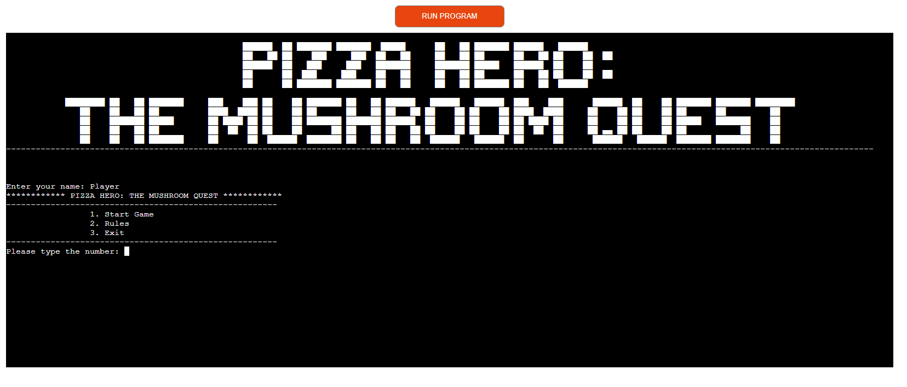

# Pizza Hero
### Text Based game inside the mushroom fantasy world
#### (Developer: Mateusz Smalarz aka [YatechDev](https://github.com/YatechDev))

[Pizza Hero - Live webpage](https://pizza-hero-742dd83e8c30.herokuapp.com/) (Right click to
open in new tab)

This project serves as the third portfolio submission for the Code Institute's Full Stack Software Development diploma (LVL 5). 

The primary focus is on showcasing proficiency in Python, and the entire development is carried out using this language.
Striving for simplicity, no external frameworks or additional languages were employed, except for the components required by the Code Institute Template.

## Project Goals

The objective of this project is to develop an engaging text-based adventure game 
titled "Pizza Hero: The Mushroom Quest." The game offers a captivating storyline 
and challenges players to navigate through a fantasy world, solve puzzles, and 
make decisions to prepare a magical pizza using their great-grandfather's recipe. 
The goal is to provide players with an immersive and entertaining experience within the realm of Mushroomville.

### User Goals
- Players can embark on a captivating adventure in the fantasy world of Mushroomville.
- Players can enjoy a unique and nostalgic gaming experience as they follow the storyline and solve puzzles.
- Players can engage in decision-making and experience the thrill of a text-based adventure game.
- Players can explore the Mushroomville town, interact with characters, and uncover the secrets of the magical pizza recipe.
- Players can experience a sense of accomplishment upon completing the game.

### Site Owner Goals
- Creating an engaging and immersive text-based adventure game that appeals to players who enjoy fantasy and storytelling.
- Designing a game with an intuitive interface and clear navigation to enhance the overall user experience.
- Integrating challenging puzzles and decision points to keep players entertained and invested in the game.
- Ensuring the game is responsive and compatible with various devices to maximize accessibility.
- Fostering a sense of accomplishment for players upon completing the game and discovering the magical pizza recipe

## User Experience

### Target Audience
The target audience for this game includes fans of text-based adventure games, 
fantasy enthusiasts, and players who appreciate storytelling in a gaming format. 
The game's nostalgic elements and unique storyline make it suitable for a diverse 
age range, appealing to both younger and adult players. The immersive world of 
Mushroomville, combined with interactive decision-making, caters to those seeking 
an enjoyable and memorable gaming experience.

### User Requirements and Expectations

Players engaging with this game anticipate an immersive adventure with 
captivating storytelling and interactive decision-making. They expect the game 
to provide a nostalgic experience reminiscent of classic text-based adventures. 
The interface should be intuitive, facilitating easy navigation through the 
Mushroomville town and interactions with various characters. Players also expect 
compatibility with different devices, enabling them to enjoy the game on computers, 
tablets, and mobile phones. Overall, users seek an entertaining and accessible 
gaming experience that combines fantasy, decision-making, and the thrill of exploration.

[Back to top &uarr;](#Pizza-Hero)

## Technologies Used

### Languages
- Python

### Frameworks & Tools
- [GitHub](https://github.com/) (create, hold and deploy repository)
- [Git](https://git-scm.com/) (source code management)
- [PyCharm](https://www.jetbrains.com/pycharm/) (IDE use to build this program)
- [CI Python Linter](https://pep8ci.herokuapp.com/) (validation of Python code)
- [Freeconvert](https://www.freeconvert.com/jpg-to-webp) (convert jpg to webp format)
- [Evernote](https://evernote.com/) (notes, screenshots)
- [Grammarly](https://www.grammarly.com/) (typography)

## Validation

During the code validation, I did not encounter any errors, except in the 
"ascii_art.py" file where ASCII graphics are located. The lines of code are 
too long to meet the PEP8 criteria. Therefore, I created a separate document 
for this graphics, and I believe it is easier to operate with it, 
seeing how each ASCII art should look.

## Testing
The tests involved selecting each possible option, checking both game endings, 
and ensuring that there are no errors along the way, and the game does not crash.

## Error handling
The code includes typical error handling for choices, meaning that if the 
player enters content other than expected, such as letters instead of numbers, 
or if they enter nothing at all, an error message appears, prompting them to 
enter the correct value again.

### Performing tests on various devices
Laptops
- MSI Katana GF76 17.3" ✅
- ASUS TUF Dash F15 15.6" ✅

[Back to top &uarr;](#Pizza-Hero)

## Bugs

| **Bug**                                                | **Fix**                                          | **Result** |
|--------------------------------------------------------|--------------------------------------------------|------------|
| Terminal on heroku is to small                         | Change the terminal size in CI Template          | Fixed      |
| Game crushed after putting wrong value to the input    | Implement error handling to every choice in game | Fixed      |
| Lines of code were too long                            | Tidy up the code and check on CI Python Linter   | Fixed      |
| Wrong ASCII art after completed the game               | Corrected path to the art                        | Fixed      |
| Error after 1 quest in game, next function didn't load | Corrected typo mistake in function               | Fixed      |

## Deployment
The website was deployed on GitHub by using following steps:
1. Login into GitHub and locate the repository - [CI_PP3_Pizza_Hero](https://github.com/YatechDev/CI_PP3_Pizza_Hero)
2. At the top of repository locate the "settings" button and click on it.
3. Now on the left sidebar find locate the "pages" button and click on it.
4. Under source heading click on the branch dropdown menu and select: master.
5. Click save.
6. You will receive link to your deployed repository like on the screen below.

Forking the GitHub repository:
1. Login into GitHub and locate the repository - [CI_PP3_Pizza_Hero](https://github.com/YatechDev/CI_PP3_Pizza_Hero)
2. At the top of repository in right corner locate the "fork" button and click on it.
3. Choose where you want to save your forked repository.

## Credits

1. [CI TEMPLATE](https://github.com/Code-Institute-Org/gitpod-full-template) - This repository was created using the
   template proposed by Code Institute.
2. [JetBrains](https://www.jetbrains.com/) - I use their software - Webstorm & Pycharm.
3. [Code Institute](https://codeinstitute.net/) - As the main source of my knowledge.
4. [Jak zaczac programowac](https://jakzaczacprogramowac.pl/) - Polish youtube channel and discord group with a lot of
   resources & tips.
5. [W3Schools](https://www.w3schools.com/), [DailyDev](https://daily.dev/) -
   As additional places where I often do additional courses or read articles and enrich my knowledge.

## Acknowledgements
- To My amazing wife Karolina, who supported me during the whole process of learning and creating the project, allowed
  me to focus on my work and keep me motivated to act all the time.
- To my family and friends - for being a great support and for their motivation.
- The entire Code Institute community on slack for great understanding and motivation every day!
- 
Unfortunately, due to the recent challenging period in my personal life, I decided to undertake 
a simple project to meet the final deadline. I want to thank the Code Institute for the opportunity I have been given.

[Back to top &uarr;](#Pizza-Hero)

